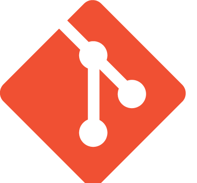

<!-- PROJECT LOGO -->
<br />
<div align="center">
  <a href="https://github.com/sudoblark/sudoblark.terraform.github">
    
  </a>

<h3 align="center">sudoblark.terraform.github</h3>

  <p align="center">
    Monolithic repo to define our GitHub Organisation in Terraform
  </p>
</div>


<!-- TABLE OF CONTENTS -->
<details>
  <summary>Table of Contents</summary>
  <ol>
    <li>
      <a href="#about-the-project">About The Project</a>
      <ul>
        <li><a href="#built-with">Built With</a></li>
      </ul>
    </li>
    <li>
      <a href="#getting-started">Getting Started</a>
      <ul>
        <li><a href="#prerequisites">Prerequisites</a></li>
        <li><a href="#installation">Installation</a></li>
      </ul>
    </li>
    <li><a href="#usage">Usage</a></li>
    <li><a href="#license">License</a></li>
  </ol>
</details>


<!-- ABOUT THE PROJECT -->
## About The Project
This repo acts as the single source of truth for the Sudoblark GitHub Organisation.

<p align="right">(<a href="#readme-top">back to top</a>)</p>

### Built With

* [terraform](https://www.terraform.io) version 1.2.7

<p align="right">(<a href="#readme-top">back to top</a>)</p>


<!-- GETTING STARTED -->
## Getting Started

Below are setup instructions to interact with this repo on MacOS.

### Prerequisites

* tfenv
  ```sh
    git clone https://github.com/tfutils/tfenv.git ~/.tfenv
    echo 'export PATH="$HOME/.tfenv/bin:$PATH"' >> ~/.bash_profile
  ```
* awscli
    ```sh
    curl "https://awscli.amazonaws.com/awscli-exe-linux-x86_64.zip" -o "awscliv2.zip"
    unzip awscliv2.zip
    ./aws/install
    ```

### Installation

1. Clone the repo
   ```sh
   git clone https://github.com/sudoblark/terraform.aws.git
   ```
2. Setup your awscli to authenticate to the Sudoblark AWS account
    ```sh
   nano ~/.aws/config
   ...
   [profile sudoblark]
    aws_access_key_id=<access key id>
    aws_secret_access_key=<access key secret>
    aws_default_region=eu-west-2
   ```

<p align="right">(<a href="#readme-top">back to top</a>)</p>


<!-- USAGE EXAMPLES -->
## Usage

1. Initialise terraform, everything is prod:
```sh
tfenv use 1.2.7
export AWS_DEFAULT_PROFILE=sudoblark
export GITHUB_TOKEN=<token>
terraform init
```
2. Then plan as expected:
```sh
terraform plan
```

All other operations are expected to be run via CI/CD.

<p align="right">(<a href="#readme-top">back to top</a>)</p>


<!-- LICENSE -->
## License

Copyright (C) Sudoblark Ltd, Inc - All Rights Reserved

Unauthorized copying of this file, via any medium is strictly prohibited

Proprietary and confidential

Written by Benjamin Clark <bclark@sudoblark.com>, 2023

<p align="right">(<a href="#readme-top">back to top</a>)</p>